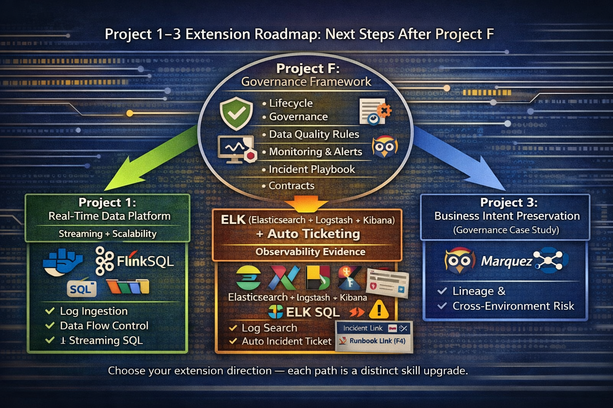

# Project F — Data Reliability & Governance Framework

This repository presents a practical **Data Reliability / Data Quality & Observability portfolio**.

It demonstrates how business-critical datasets can become:

- trustworthy  
- governable  
- auditable  
- incident-ready  

Project F focuses on building the **controls and evidence layer** that makes data a reusable enterprise asset.

---

## ✅ Core Deliverables (Project F)

Project F is a complete governance framework with concrete reliability artifacts:

| Capability | Deliverable File |
|-----------|------------------|
| **F1 — Data Lifecycle Governance** | [`01-data-lifecycle.md`](./01-data-lifecycle.md) |
| **F2 — Data Quality Rules Catalog** | [`02-data-quality-rules.md`](./02-data-quality-rules.md) |
| **F3 — Monitoring & Alert Specification** | [`03-monitoring-alert-spec.md`](./03-monitoring-alert-spec.md) |
| **F4 — Incident Response Playbook** | [`04-incident-response-playbook.md`](./04-incident-response-playbook.md) |
| **F5 — Data Contracts (Schema Guarantees)** | [`05-data-contracts.md`](./05-data-contracts.md) |
| **F6 — Metadata & Lineage Evidence** | [`06-metadata-lineage.md`](./06-metadata-lineage.md) |

---

## 🧾 ISO 27001 Evidence Pack (Project D Extension)

This portfolio includes an **audit-ready mapping pack** aligned with ISO/IEC 27001 Clause 4–10.

📂 Location:
case-studies/iso27001-audit-evidence/

This extension demonstrates how reliability controls produce governance evidence for:

- scope & ownership  
- risk-based control selection  
- operational execution  
- monitoring & review  
- continuous improvement  

*(Project D is an evidence extension, not a separate implementation track.)*

---

## 🚀 Extension Roadmap (Projects 1–3)

After completing Project F, the framework can be extended in three applied directions:

### **Project 1 — Streaming SQL Reliability**
Real-time quality enforcement and decision-readiness validation using SQL.

### **Project 2 — ELK Observability Evidence + Auto Ticketing**
Logs, alert evidence, and minimal incident automation (Alert → Ticket → Runbook).

### **Project 3 — Business Intent Preservation Case Study**
Governance validation across transformations using **Marquez + OpenLineage**.

---

### Roadmap Overview

---

## Why This Portfolio Matters

This work is not about collecting tools.

It validates a core enterprise question:

> Can business intent, governance controls, and auditability survive across data transformations?

Project F demonstrates how reliable data systems are built through:

- quality controls  
- monitoring evidence  
- ownership accountability  
- incident readiness  
- continuous governance improvement  

---

## Author

**Pi Hsin Tsai**  
Focus: Data Reliability / Data Quality & Observability Engineering

