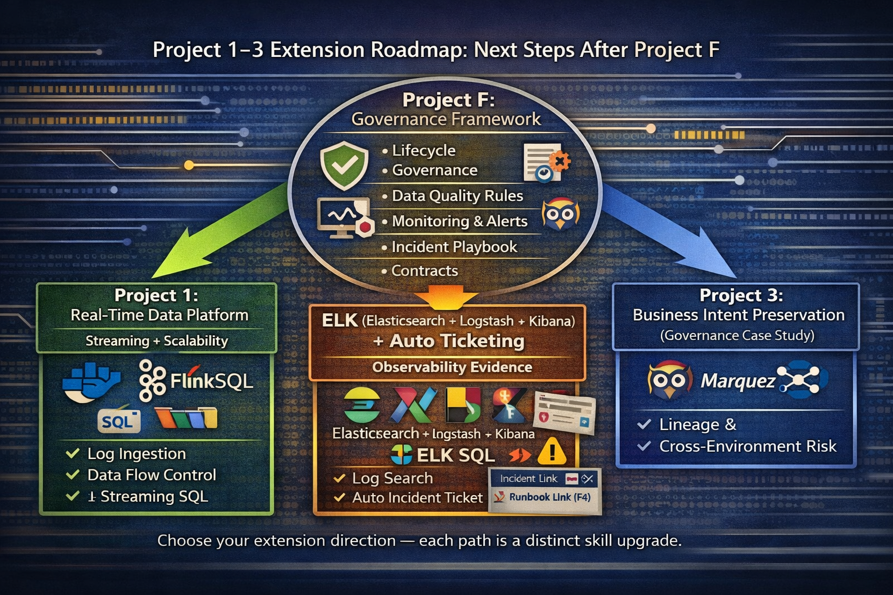

# Data Reliability Framework

A telemetry-driven governance repository for data reliability, data quality, observability evidence, and audit-aligned review.

This repository started as a governance framework for Project F and has now evolved into a **working governed-domain repository** with Smart City as the first pilot domain.

It is designed to answer a practical governance question:

> How do we turn runtime telemetry, quality evidence, and failure signals into structured governance review, exception handling, and control evidence?

---

## Repository Purpose

This repository is the governance and evidence-consumption layer for data reliability work.

It does **not** implement upstream data pipelines directly.  
Instead, it consumes telemetry and curated evidence produced by implementation repositories, and turns them into:

- scorecards
- exception rules
- exception registers
- monthly governance reviews
- observed metrics summaries
- audit-aligned evidence artifacts

This means the repository focuses on:

- reliability governance
- evidence interpretation
- risk classification
- control-oriented review
- repeatable monthly decision support

---

## Current Working Model

The repository currently operates with the following model:

1. **Implementation repositories** produce telemetry and curated evidence.
2. This repository ingests those outputs under `evidence/`.
3. Governance analysis scripts summarize observed operational, freshness, and quality conditions.
4. Governance artifacts convert evidence into:
   - scorecards
   - exception tracking
   - monthly review outputs
   - future audit and management-review evidence

The first active governed pilot domain is:

- **Smart City Air Quality**

---

## Current Repository Structure

### Governance framework
- `domains/`
- `contracts/`
- `governance/`
- `incidents/`
- `kpi/`
- `guides/`

### Evidence and analysis
- `evidence/`
- `reports/`
- `scorecards/`
- `exceptions/`
- `scripts/`

### Upstream and reference material
- `upstream-docs/`

---

## Smart City Pilot Domain

Smart City is the first governed pilot domain in this repository.

It provides real telemetry and curated evidence for governance review, including:

- pipeline run logs
- pipeline trace logs
- pipeline metrics
- quality metrics
- freshness metrics
- structured error evidence
- raw runtime events

These are used to produce:

- `reports/smart_city_reliability_summary.md`
- `reports/smart_city_failure_taxonomy.md`
- `reports/smart_city_observed_metrics.md`
- `reports/generated/smart_city_observed_metrics.json`
- `scorecards/smart_city_scorecard.yaml`
- `exceptions/smart_city_exception_rules.yaml`
- `exceptions/smart_city_exception_register.md`
- `governance/monthly_review_smart_city.md`

---

## Why telemetry-first instead of ELK-first

For Project 2, this repository currently follows a **telemetry-first observability approach**.

This choice is intentional.

### Why telemetry-first
- Telemetry is already structured for governance use:
  - `run_id`
  - `trace_id`
  - `step_name`
  - `status`
  - `error_type`
  - `severity`
  - `retryable`
- Telemetry integrates directly with:
  - scorecards
  - exception tracking
  - monthly governance review
  - observed metrics JSON
- Telemetry is lighter to operationalize than a full ELK stack
- Telemetry is better suited for governance evidence normalization and repeatable review outputs

### What ELK still offers
ELK remains a valid future extension path for:

- log search
- search-centric operational investigation
- dashboard-driven incident workflows
- alert-to-ticket operational evidence experiments

### Current position
This repository does **not** reject ELK.  
Instead, it establishes a telemetry-first baseline first, and leaves ELK as a future comparison experiment.

---

## Project F Extension Roadmap

After completing Project F, the framework can be extended in three applied directions:

*Figure: Project F governance framework with three applied extension paths (SQL reliability, observability evidence automation, and business intent preservation).*

---

## Extension Repo Mapping

The roadmap remains applicable, but the repository alignment is now clarified as follows:

### Project 1 — Streaming SQL Reliability
**Primary alignment:** `governed-patent-analytics-and-retrieval-platform`

Focus:
- real-time or near-real-time SQL validation
- quality enforcement close to business rules
- decision-readiness validation
- structured rule enforcement

This direction is best represented in a repository where SQL-oriented validation and governed analytical logic are central.

---

### Project 2 — ELK Observability Evidence + Auto Ticketing
**Primary alignment:** `data-reliability-framework`

Current implementation path:
- telemetry-first governance evidence
- observed metrics analysis
- scorecards
- exception tracking
- monthly governance review

Planned future extension:
- comparison experiment between telemetry-native governance evidence and ELK-based operational observability workflows

Auto-ticketing in this repository is currently planned as **governance-level pseudo auto-ticketing**, rather than a full enterprise ticketing stack.

That means this repository can generate:
- ticket candidates
- incident candidates
- action-needed records
- runbook-linked governance actions

A more operational Alert → Ticket → Runbook experiment may be prototyped in the Smart City implementation repository.

---

### Project 3 — Business Intent Preservation
**Primary alignment:** merged into `data-reliability-framework`

Project 3 is incorporated into this repository as the governance validation and intent-preservation extension path.

This direction expands the framework from reliability-only review into:

- governance validation across transformations
- lineage-aware review
- business intent preservation
- cross-environment risk interpretation

This means the repository does not only assess whether pipelines run, but also whether transformation outputs continue to preserve:

- intended governance meaning
- control interpretation
- decision context
- cross-environment consistency

Companion policy-heavy repositories may still provide case-study material, but the primary integration point for this direction remains this repository.

---

## Current Governance Capabilities

The repository now supports:

- domain registration
- contract templates
- KPI / SLA / SLO catalog structure
- incident thresholds
- scorecard production
- exception rule definition
- exception register tracking
- monthly governance review
- telemetry-driven observed metrics analysis

This allows the framework to move from static documentation into **repeatable governance review**.

---

## Planned Next Direction

The next phase of work is intentionally sequenced.

### Priority order

#### 1. ISO 27001-aligned extension
This is the current priority.

Why first:
- the repository already has structured evidence
- governance outputs already exist
- review cadence already exists
- control/evidence mapping is now the most natural next step

Planned outputs:
- ISO 27001 control-to-evidence mapping
- management review inputs/outputs
- corrective action tracking
- audit-aligned evidence index

#### 2. Governance-level pseudo auto-ticketing
After control/evidence mapping is clearer, this repository can add lightweight automation for:

- ticket candidate creation
- exception escalation signals
- action-needed outputs
- runbook-linked governance responses

#### 3. Governance validation across transformations
This is the merged Project 3 direction.

Planned focus:
- transformation-aware governance review
- lineage interpretation
- intent preservation checks
- downstream meaning preservation

#### 4. Cross-environment risk interpretation
This extends Project 3 by asking whether governance meaning remains preserved across:

- environments
- processing stages
- transformation layers
- policy contexts

#### 5. Optional ELK comparison experiment
This is a valid extension, but not the current priority.

It should be treated as a comparison path:
- telemetry-first governance evidence
- versus
- ELK-backed operational evidence workflows

---

## Current Review Logic

The repository currently interprets evidence across at least five governance dimensions:

- operational reliability
- data quality
- freshness / timeliness
- incident / exception posture
- evidence integrity / normalization

This has already been demonstrated using the Smart City pilot domain.

---

## Example Workflow

A typical workflow now looks like this:

1. Upstream implementation repo produces telemetry and curated evidence
2. Evidence is copied into `evidence/<domain>/`
3. Analysis script runs:
   - `python scripts/analyze_smart_city_telemetry.py`
4. JSON and markdown observed metrics are generated
5. Scorecard is updated
6. Exception register is updated
7. Monthly governance review is refreshed

This is the operational loop that turns raw telemetry into governance review.

---

## Upstream Evidence Sources

This framework reviews telemetry, quality, and operational evidence produced by implementation repositories.

One active upstream example is the Smart City air-quality platform, which emits runtime logs, span events, metric events, quality summaries, and structured failure evidence for downstream governance and review.

---

## Positioning

This repository should now be understood as:

**a telemetry-driven data governance repository with Smart City as the first governed pilot domain**

It is no longer only a static framework repository.  
It is now a working governance layer capable of consuming evidence and producing structured review outputs.

---

## Author

**pickhottea**  
Focus: Data Reliability / Data Quality & Observability Engineering